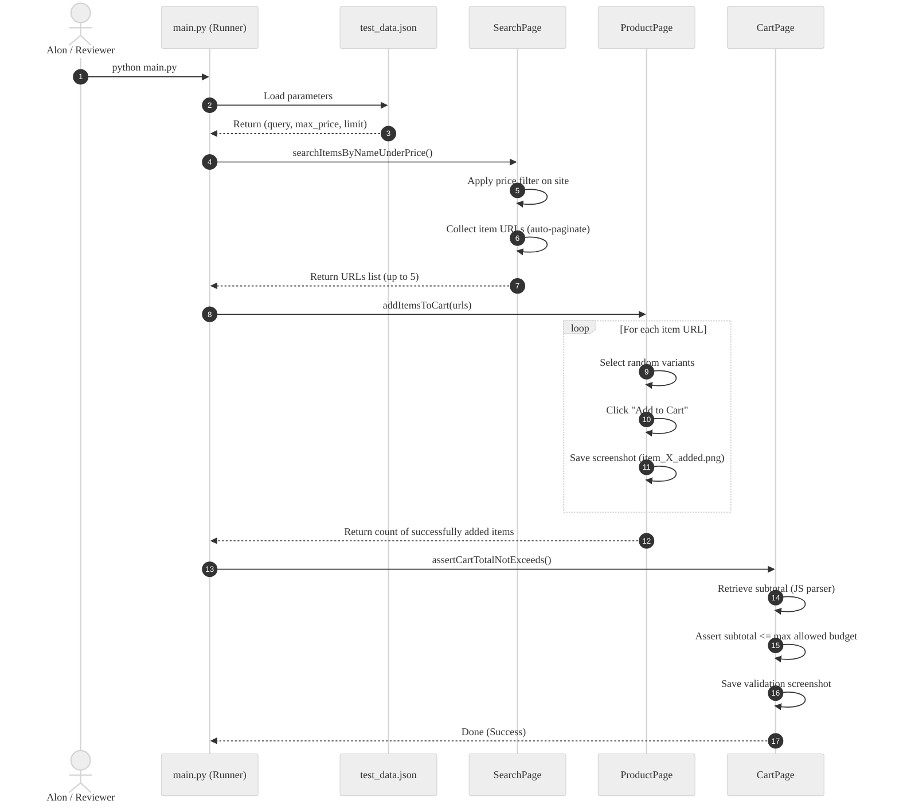

# eBay E2E Test Automation Framework

A premium, high-performance, and maintainable end-to-end (E2E) test automation suite for eBay. Built using **Python**, **Playwright**, and **pytest**, this framework follows the Page Object Model (POM), Object-Oriented Programming (OOP), Single Responsibility Principle (SRP), and Data-Driven testing design guidelines.

## 📊 Project Execution Flow
The sequence diagram below visualizes the execution flow of `main.py` calling the page objects:



---

## 📋 Features & Architecture

*   **Page Object Model (POM)**: Separates page-specific selector elements and browser interaction methods from the test logic.
    *   `SearchPage`: Handles searches, sidebar price filters, page scraping, and page-by-page pagination.
    *   `ProductPage`: Identifies item options and dynamic dropdowns (size/color), selects random variants, and adds items to the cart.
    *   `CartPage`: Opens the shopping cart, extracts the total subtotal, and validates budget calculations.
*   **Data-Driven Configuration**: Read test parameters dynamically from the external configuration file `config/test_data.json` instead of hardcoding values.
*   **Robust Selectors & Auto-Waiting**: Playwright automatically handles element states (visibility, activity), replacing fragile static waits.
*   **Anti-Bot & Captcha Mitigation**: Utilizes specialized User-Agents, locale constraints, and viewport configurations to bypass anti-bot security systems.
*   **Screenshots & Reporting**: 
    *   Captures screenshots on every successful item addition and final cart verification.
    *   Automatically captures error screenshots on any test failure.
    *   Generates an interactive, self-contained HTML report detailing execution logs and embedding screenshots.
*   **CI/CD Integration**: Preconfigured with a **GitHub Actions** cloud workflow (`.github/workflows/run-tests.yml`) to automatically execute tests on code pushes and upload results as build artifacts.

---

## 🛠️ Prerequisites

*   **Python**: Python 3.11 or newer.
*   **pip**: Python package installer.

---

## 🚀 Setup & Installation

1.  **Clone the Repository**:
    ```bash
    git clone <repository-url>
    cd ebay-automation-tests
    ```

2.  **Install Python Dependencies**:
    ```bash
    pip install -r requirements.txt
    ```

3.  **Install Playwright Web Driver**:
    ```bash
    python -m playwright install chromium
    ```

---

## 🏃 Running the Tests

You can run the assignment either as a standalone script or through the pytest framework:

### 1. Direct Script Execution (main.py - Recommended for Review)
Runs the three requested functions sequentially in a visible, headed browser window so you can watch the automated flow live:
```bash
python main.py
```

### 2. Pytest Execution (Generates HTML Report)
Runs tests in the background (headless) and generates an interactive, self-contained HTML report with embedded screenshots:
```bash
pytest --html=reports/report.html --self-contained-html
```
*The HTML report is saved under `reports/report.html` and can be opened in any browser.*

### 3. Pytest Headed Run (Watch execution via pytest)
```bash
pytest --headed --html=reports/report.html --self-contained-html
```

---

## 📂 Project Structure

```
ebay-automation-tests/
├── .github/
│   └── workflows/
│       └── run-tests.yml      # CI/CD GitHub Actions cloud workflow
├── config/
│   └── test_data.json         # Data-driven JSON inputs (search query, max price, limit)
├── pages/
│   ├── base_page.py           # Shared utilities (navigation, screenshots, auto-waits)
│   ├── search_page.py         # Search page, price filter, pagination
│   ├── product_page.py        # Product details, variant selection, add to cart
│   └── cart_page.py           # Cart page, subtotal reading and assertion
├── reports/                   # Holds generated HTML reports
├── screenshots/               # Holds step screenshots (item added, cart subtotal, failures)
├── tests/
│   ├── conftest.py            # Pytest browser configuration fixtures & hooks
│   └── test_ebay_flow.py      # E2E shopping flow test case
├── utils/
│   ├── helpers.py             # Price cleaner and parsing logic
│   └── logger.py              # Log setup
├── requirements.txt           # Python library dependencies
└── ReadMeAIBugs.md            # Static code analysis of the buggy AI script
```

---

## ⚙️ Data-Driven Inputs Configuration

To change the search items or target budget values, modify `config/test_data.json`:
```json
{
  "search_query": "shoes",
  "max_price": 220.0,
  "item_limit": 5
}
```

*   `search_query`: The item to search for on eBay.
*   `max_price`: The maximum allowed budget price per single item.
*   `item_limit`: The target number of items to collect and add to the cart.

---

## ⚠️ Assumptions & Limitations

1.  **Guest Flow**: Per instructions, the login stage is stubbed out. The test executes as a Guest Checkout (searching, picking variants, adding to cart, and checking out total price) to avoid captcha blocks on authentication forms.
2.  **Locale / Currency**: Prices are parsed using regex-based extraction. The system cleans currency symbols (`$`, `₪`, `£`, `ILS`, etc.) and supports both dot (`.`) and comma (`,`) decimal separators.
3.  **Variant Selection**: If a product has variant dropdowns (e.g. shoe size, color), the framework selects a random option among the available ones. If no option is selected or required, it skips directly to "Add to cart".
