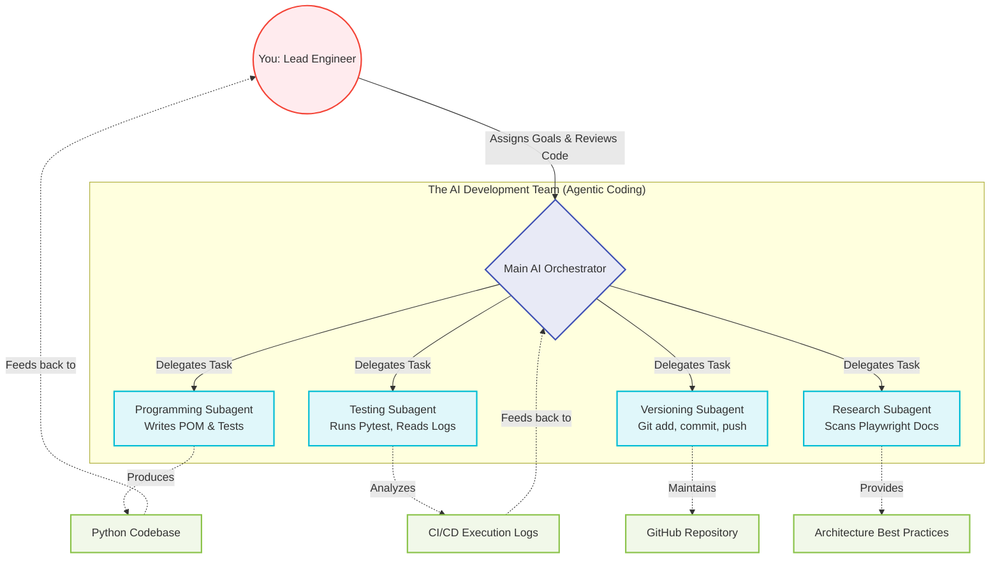

# AI-Driven Development & Subagent Orchestration

Modern software engineering is rapidly shifting towards Agentic AI. If the interviewers ask you about how you leverage AI tools to accelerate your development (like in the "Bug Fixing" exercise), you can present this workflow to show that you don't just "copy-paste from ChatGPT," but rather orchestrate a team of specialized AI agents.

### Key Talking Points for the Interview:
1. **The "Lead Engineer" Mindset:** Explain that you view AI not as a cheat code, but as a team of junior developers. *"I act as the Systems Architect. I define the Page Object Model structure, set the testing strategy (like using Playwright over Selenium), and review the code. The AI subagents do the heavy lifting of typing out boilerplate, executing Git commands, and parsing test failure logs."*
2. **Specialized Subagents:** You can mention how modern Agentic coding works. You don't ask one AI to do everything. You have a background "Testing Agent" that runs Pytest, reads the terminal output, and tells the "Programming Agent" exactly which line failed. 
3. **CI/CD Integration:** Explain that your workflow perfectly mirrors a CI/CD pipeline. The AI writes the code, the testing agent verifies it locally, and the versioning agent safely pushes it to GitHub, triggering the remote pipeline.
