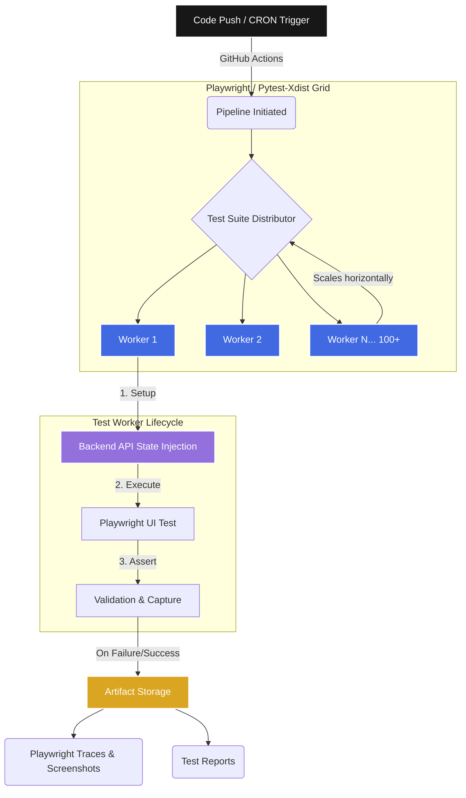

# Enterprise Test Automation Architecture

This diagram illustrates a scalable, modern CI/CD pipeline for executing UI automation tests at an enterprise scale.

## Pipeline Architecture

### Key Components:
1. **GitHub Actions (CI/CD)**: Replaces standard local `cron` jobs. It provides managed compute, robust scheduling, triggering via pull-requests, and native artifact retention.
2. **Parallel Test Grid**: Instead of running 1,000 tests linearly (which would take 16+ hours), tests are distributed across a fleet of workers using `pytest-xdist` or a cloud grid provider (like SauceLabs/BrowserStack).
3. **API State Injection**: Crucial for test independence. Instead of "interconnected tests" where Test B relies on Test A (which breaks during parallel execution), the worker securely calls backend APIs to generate independent test data instantly before the UI test launches.
4. **Artifact Storage**: Traces, HAR network logs, and screenshots are automatically persisted in the CI pipeline for offline debugging.
