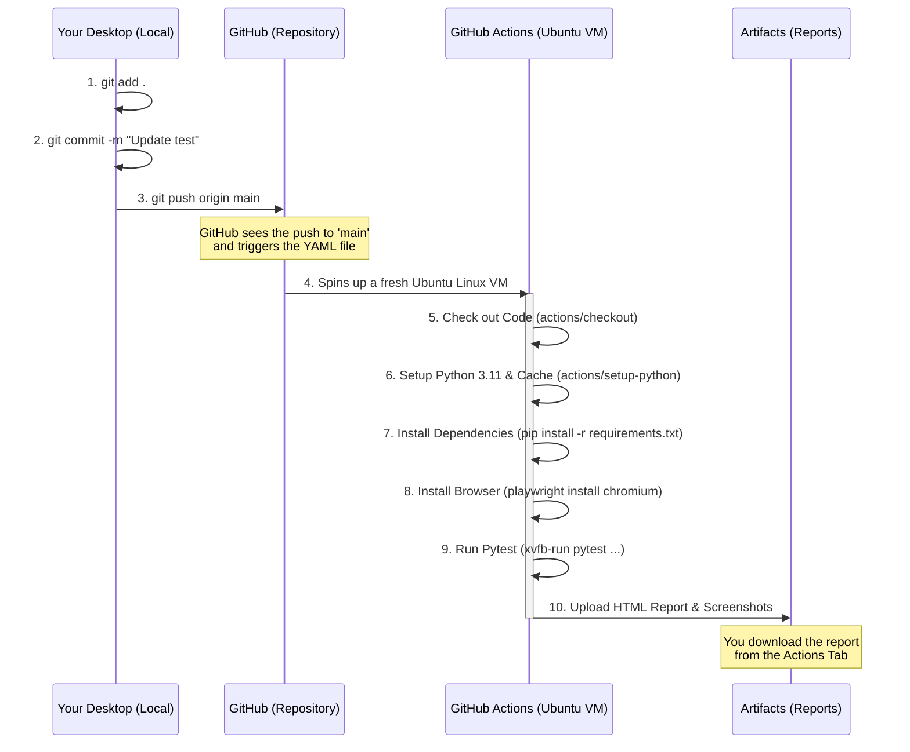

# From Desktop to GitHub Actions: The CI/CD Flow

This document explains exactly what happens when you push a new version of your Playwright test from your desktop up to GitHub, and how the `.github/workflows/run-tests.yml` file orchestrates the execution.

## The Visual Workflow Diagram



---

## Step-by-Step Explanation

If the interviewer asks you to walk them through the CI/CD process of your project, here is exactly how you can explain it based on your actual `run-tests.yml` file:

### Phase 1: The Local Push (Your Desktop)
When you make a change to your Python code locally, you run three commands:
1. `git add .` (Stages the files)
2. `git commit -m "My new code"` (Saves the snapshot)
3. `git push origin main` (Sends the code to the cloud)

### Phase 2: The Trigger (GitHub)
Inside your repository, you have a file at `.github/workflows/run-tests.yml`. At the very top of this file, you have a block that looks like this:
```yaml
on:
  push:
    branches: [ main ]
```
This is the **Trigger**. GitHub constantly monitors this file. The moment it detects that code was pushed to the `main` branch, it says, *"Aha! I need to start a workflow."*

### Phase 3: The Environment Setup (The CI Server)
GitHub spins up a completely fresh, empty virtual computer (in your case, an `ubuntu-latest` Linux machine). Because this computer is empty, it needs to follow the `steps:` in your YAML file to prepare itself:
1. **Checkout Code:** It downloads your code from the repository onto the VM.
2. **Setup Python:** It installs Python version 3.11.
3. **Install Dependencies:** It runs `pip install -r requirements.txt` so it has pytest and playwright installed.
4. **Install Browsers:** It runs `playwright install chromium` so the VM actually has a browser engine to test against.

### Phase 4: Execution & Virtual Displays
Once the environment is ready, it reaches the `Run E2E Tests` step:
```yaml
xvfb-run python -m pytest --headed --html=reports/report.html
```
* **What is `xvfb-run`?** Because the Ubuntu server in the cloud doesn't have a real physical monitor, Playwright would normally crash if you told it to run `--headed` (with a visible UI). `xvfb-run` creates a **fake, virtual monitor** in the Linux memory so the browser thinks it is rendering on a real screen!

### Phase 5: Artifacts (The Output)
After the test finishes (whether it passes or fails), the VM is about to destroy itself. But before it does, the `Upload Test Report` step runs. 
It takes your `reports/` and `screenshots/` folders and zips them up into an **Artifact**. You can then go to the "Actions" tab on GitHub, click on the run, and download that ZIP file to view your HTML report exactly as it looked on the server.

> [!TIP]
> **Bonus talking point for the interview:** Mention the `workflow_dispatch` trigger! Your YAML file is configured so that a Product Manager or QA tester can go to the GitHub website, click "Run workflow", and manually type in a new search query (like "laptops") or a new budget (like "500"). The YAML file captures those inputs and dynamically overwrites your `config/test_data.json` file before the test runs. This is the pinnacle of Data-Driven CI/CD!
