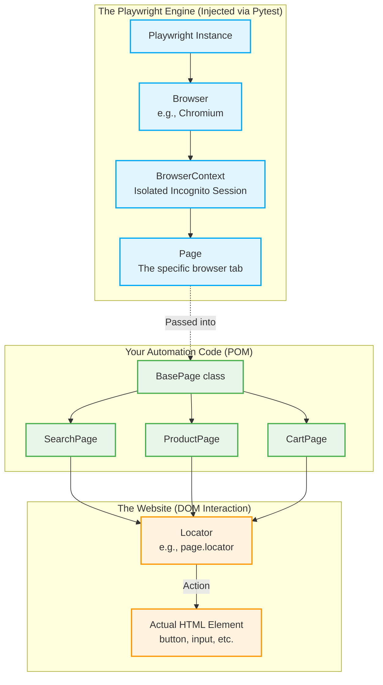

# Playwright Object Hierarchy in Your Framework

When the interviewer asks, *"How does Playwright actually work under the hood, and what objects are you interacting with?"*, you can use this diagram to explain the core Playwright hierarchy and how you inject it into your Page Object Model (POM).

### Key Talking Points for the Interview:
1. **The BrowserContext:** Playwright is powerful because it uses `BrowserContexts`. You can explain: *"Instead of launching a heavy, full browser for every test like Selenium does, Playwright launches one Browser and creates isolated, incognito `BrowserContexts` for each test. This makes tests run incredibly fast and ensures cookies/cache don't leak between tests."*
2. **The `Page` Object:** Your Pytest fixture automatically hands you the `Page` object (representing the active tab). You immediately pass this `Page` into your `BasePage`, which shares it with all your Page Objects (`SearchPage`, `CartPage`).
3. **The `Locator` Object:** Playwright doesn't find elements immediately. It creates a `Locator`—a strict recipe for finding an element. You can explain: *"Playwright Locators are evaluated strictly at the moment of action (like `.click()`). This enables Auto-waiting, because the Locator will constantly poll the DOM until the element is visible and actionable, preventing Stale Element Exceptions."*
