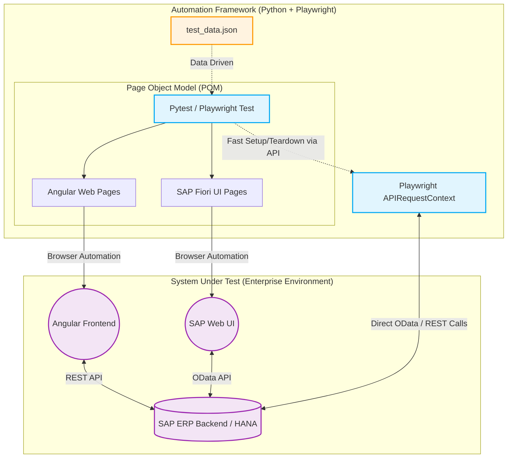

# Playwright + Angular + SAP Architecture

This diagram illustrates how your Python Playwright framework would integrate into an enterprise environment where the frontend is built with **Angular** and the backend is an **SAP** ERP system. 

It highlights how your **Page Object Model (POM)** interacts with the Angular UI, and how you can use Playwright's native API capabilities to interact directly with the SAP backend (OData/REST APIs) for faster test setup and teardown.

### Key Talking Points for this Diagram:
1. **Angular Frontend (SPAs):** Angular is a Single Page Application. Because elements render dynamically, Selenium often fails here. Playwright's **Auto-waiting** handles Angular's dynamic DOM flawlessly.
2. **SAP Backend (Heavy Systems):** SAP is a massive, slow ERP system. Notice the dotted line from the `TestRunner` to the `SAPBackend`. Instead of automating the SAP UI to create a user or seed test data, a senior engineer uses **Playwright's APIRequestContext** to inject data directly into SAP via API, bypassing the UI completely. This saves minutes of test execution time!
3. **Data-Driven (Config):** The test data flows seamlessly into the tests, just like in your eBay assignment.

*You can open this artifact to view the diagram visually.*
